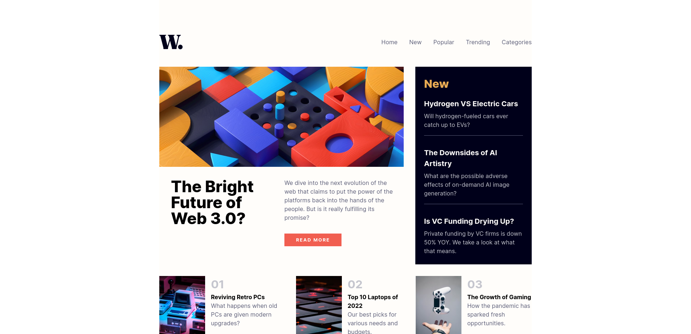

# Frontend Mentor - News homepage solution

This is a solution to the [News homepage challenge on Frontend Mentor](https://www.frontendmentor.io/challenges/news-homepage-H6SWTa1MFl). Frontend Mentor challenges help you improve your coding skills by building realistic projects.

## Table of contents

- [Overview](#overview)
  - [The challenge](#the-challenge)
  - [Screenshot](#screenshot)
  - [Links](#links)
- [My process](#my-process)
  - [Built with](#built-with)
  - [What I learned](#what-i-learned)
- [Author](#author)

## Overview

### The challenge

Users should be able to:

- View the optimal layout for the interface depending on their device's screen size
- See hover and focus states for all interactive elements on the page

### Screenshot

### Links

- Solution URL: [Frontend Mentor](https://www.frontendmentor.io/solutions/responsive-news-homepage-using-nuxtvue-and-tailwind-css-A16y623ZUK)
- Live Site URL: [Github Pages](https://linchutchinson.github.io/fm-news-homepage/)

## My process

### Built with

- [Nuxt 3](https://nuxt.com/)
- [Tailwind CSS](https://tailwindcss.com/)
- Flexbox
- CSS Grid

### What I learned

#### Reactive Web Design

This was my first time building a webpage that's fully reactive, with different layouts and behaviors at different sizes. Initially, I built the desktop version of the page and then added the mobile design on afterwards. But towards the end, as I was working with Tailwind's [Breakpoint Prefixes](https://tailwindcss.com/docs/responsive-design), I realized that Tailwind was built following the whole "mobile-first" idea, which I had heard of before, but never really thought through until now.

I think with my next project, I'll build the mobile version of the app first to see if approaching things from that direction is easier. In the abstract, it seems reasonable that it would be easier to build out the elements at the small scale and then have them expand to fit a larger screen, rather than building them large and then compressing them.

#### Nuxt with Github Pages

Getting Nuxt's static site generation features to work correctly was a little bit fiddly. Part of it was Github's fault. Apparently without adding a `.nojekyll` file to your output folder, github will default to eating any folders that start with an underscore. In nuxt that meant my javascript and css files which was a bit of an issue.

The other problem I encountered came in applying a base url to all my src addresses. When generating the site with `NUXT_APP_BASE_URL` set as an env var, _most_ of my urls were updated to accomodate the change. I had to go in and manually make adjustments in two places, however. The first was with the Top Articles section, where I was generating the `` components from a list of data using Vue's list rendering. The second spot was with the favicon, which despite being a statically assigned part of the app's config, still needed to be readjusted in a layout rather than in the nuxt config.

I can understand the list rendering issue if the list is rendered after whatever code handles fixing urls, but the favicon problem seems egregious. I didn't find any resources in the Nuxt docs that explained what I was supposed to do, but I suspect I was doing something wrong. It's a point for continued study.

## Author

- Website - [Lincoln Hutchinson](https://www.linchutchinson.com)
- Frontend Mentor - [@lincolnhutchinson](https://www.frontendmentor.io/profile/lincolnhutchinson)
